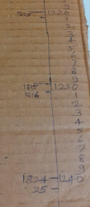

# About calendars-scale
* Display Hijri and Gregorian calendars alongside. For example, in the case of a ruler or scale, where the metric (centimeter) and imperial (inches) measurements are shown alongside each other.
* Maybe extend this to include other calendar systems too.
* Build this using Javascript, and make this available for use on mobile, desktop, and other devices.
* Shouldn't need an internet connection to work with the scale.

This was triggered by this DIY scale created on a piece of cardboard

## Features that could be helpful
* Maybe a zoom facility would be great. With increasing levels of granularity
  * zooming in from years -> months -> days
  * Use the pinch-to-zoom ability to zoom in / out
* default display is current year +- 10 years
  * Can set 1850 or a specific date as the default year
* option to select a specific date (hijri or gregorian)

## References
* "Islamic-Western Calendar Converter; Based on the Arithmetical or Tabular Calendar" https://webspace.science.uu.nl/~gent0113/islam/islam_tabcal.htm
* "A Jalaali (Jalali, Persian, Khorshidi, Shamsi) calendar system plugin for moment.js" - https://github.com/jalaali/moment-jalaali
* "A Hijri (Based on Umm al-Qura calculations) calendar system plugin for moment.js" - https://github.com/xsoh/moment-hijri
